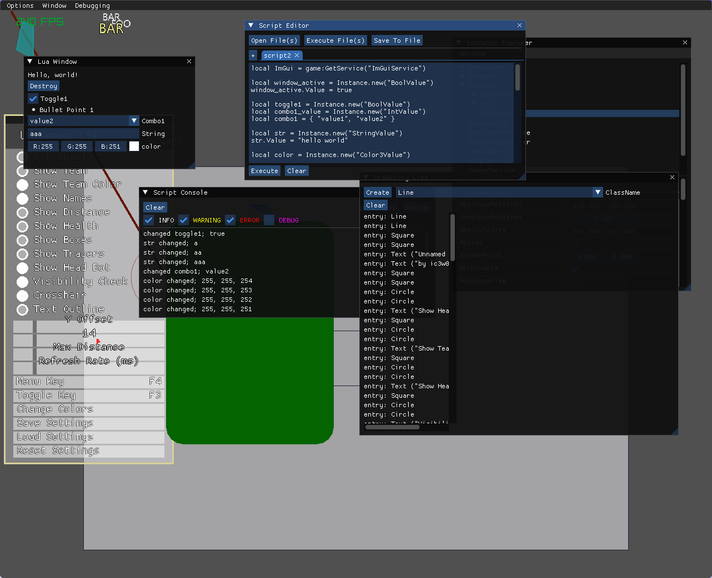

# fakeroblox

fakeroblox is an attempt to create a Luau environment that is as close to Roblox's as possible.

creation date: Jun 25, 2025



# PROJECT STATE

This project is in early development stages! This is why there is no Windows support!

In addition, I am frequently making drastic changes on my local machine before pushing to GitHub (I bounce back and forth between areas) so the state of the project rarely matches what is public.

Issues, however, usually closely match the project's real state.

# BUILDING
NOTE: fakeroblox CURRENTLY does _not_ have a process for building neither for or on Windows. It is likely possible to cross compile via mingw, but that would require manual steps.

fakeroblox uses [mate.h](https://github.com/TomasBorquez/mate.h/) for its core build system, along with some python files to build the dependencies.
<br>
To build dependencies, first ensure you have their respective dependencies installed. You can usually find this on each project page, but here is a command you can run on Ubuntu for reference:
```bash
sudo apt-get install cmake build-essential git \
    libasound2-dev \
    libx11-dev \
    libxrandr-dev \
    libxi-dev \
    libgl1-mesa-dev \
    libglu1-mesa-dev \
    libxcursor-dev \
    libxinerama-dev \
    libwayland-dev \
    libxkbcommon-dev \
    libpsl-dev
```
Then just run each script inside the dependencies folder with python:
```bash
cd dependencies

python3 ./build_curl.py & \
python3 ./build_rlImGui.py & \
python3 ./build_luau.py

# after rlImGui has fetched imgui

python3 ./build_ImGuiFileDialog.py

cd ..
```

then, to bootstrap mate, compile and run mate.c (note that I target gcc, so clang and msvc may or may not be supported):
```bash
gcc -o mate mate.c
./mate
```

That's it! To build again, simply run `./mate` just like before and it will detect any changes made and recompile only what's needed.

# GOALS
* Instance system
* 1:1 Roblox error messages
* input
* 2d graphics
* sound
* exploit functions (most similar to Synapse)

# NONGOALS
* 3d graphics
* networking
* server (there is only the client and that is where everything exists)
* rbxl or rbxm parsing

Contributions to nongoals may be welcome (ONLY AFTER THE PROJECT IS AT A MORE STABLE STATE), but they aren't something I will be focusing on.
